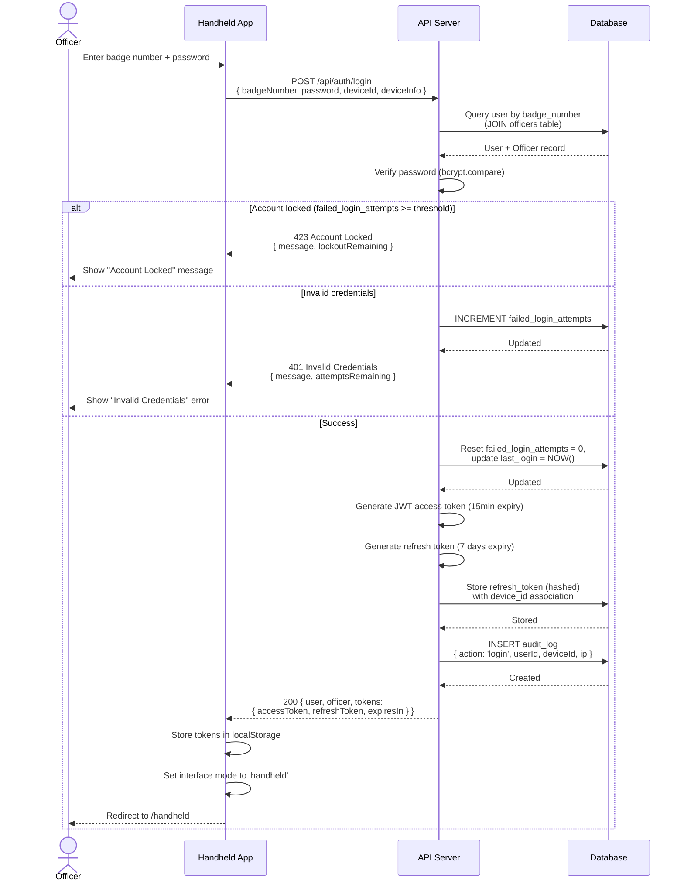
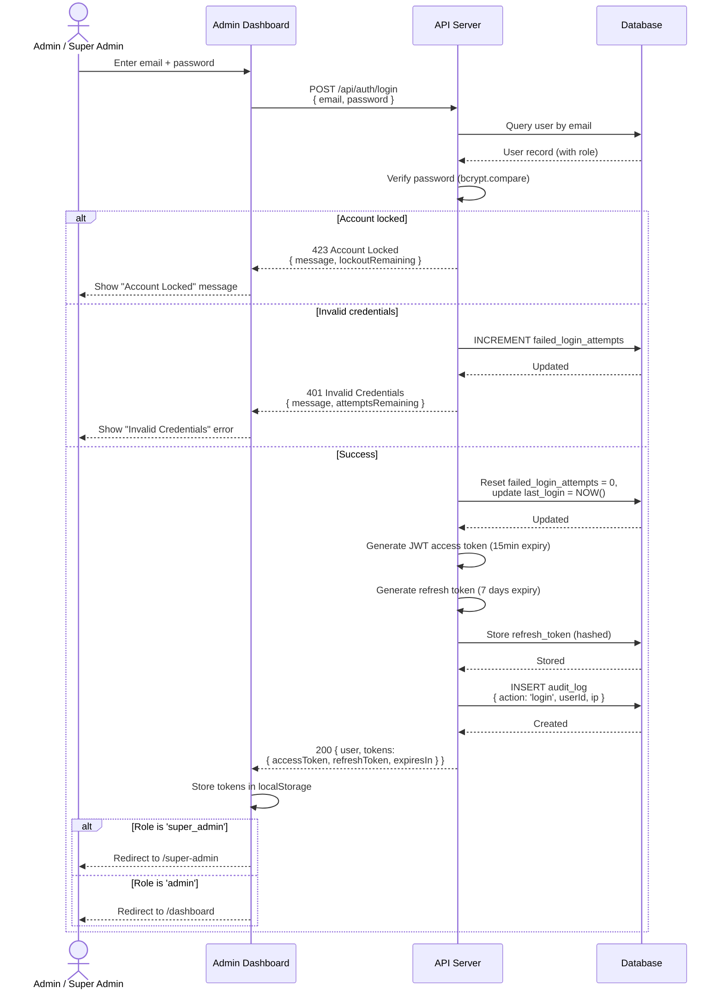
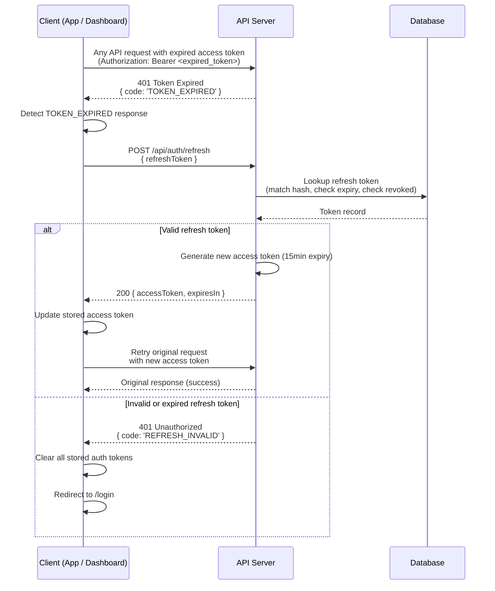
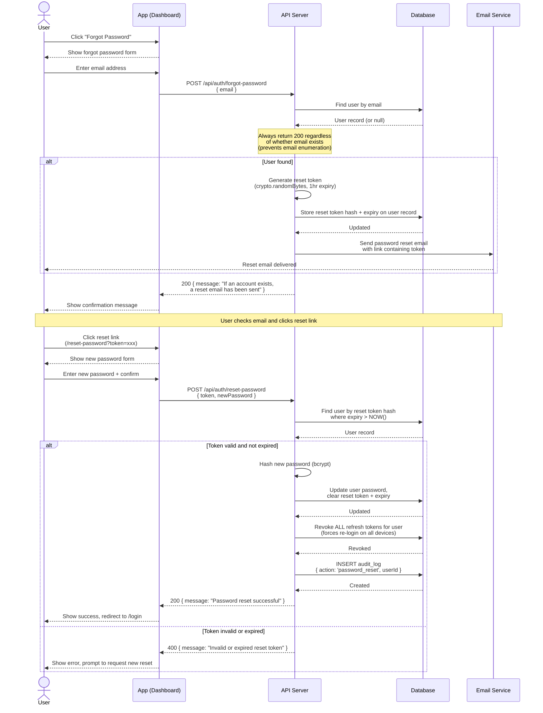

# Authentication Flows

This document contains sequence diagrams for all authentication-related flows in the Ghana Police Ticketing System.

---

## 1. Officer Login (Handheld)

Officers authenticate via their badge number and password from the handheld device.

---

## 2. Dashboard Login (Admin / Super Admin)

Admin and Super Admin users authenticate via email and password from the web dashboard.

---

## 3. Token Refresh

Transparent token refresh flow when an access token expires during a session.

---

## 4. Password Reset

Full password reset flow via email for dashboard users.

