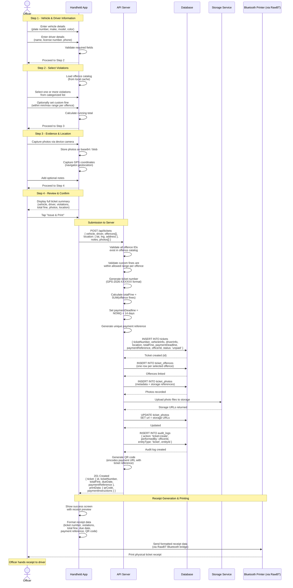

# Ticket Creation (Online)

This document contains the sequence diagram for the complete ticket creation flow when the officer's handheld device has network connectivity.

---

## Online Ticket Issuance Flow

The officer progresses through a 4-step form before submitting the ticket to the API server for processing, storage, and receipt printing.

