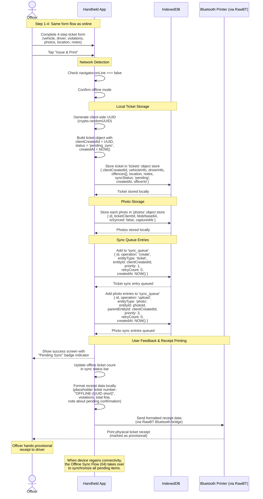

# Ticket Creation (Offline)

This document contains the sequence diagram for ticket creation when the officer's handheld device has no network connectivity. Tickets are stored locally in IndexedDB and queued for sync when connectivity is restored.

---

## Offline Ticket Issuance Flow

The officer completes the same 4-step form as the online flow, but data is persisted locally with a sync queue entry for later synchronization.

