# Offline Sync Flow

This document contains the sequence diagram for the synchronization process that runs when a handheld device regains network connectivity. The sync service processes all queued offline operations, handling deduplication, conflicts, and retries.

---

## Sync Service Processing

When the browser fires the `online` event, the SyncService processes all pending items from IndexedDB in priority-ordered batches.

```mermaid
sequenceDiagram
    participant Browser
    participant App as Handheld App
    participant Sync as SyncService
    participant IDB as IndexedDB
    participant API as API Server
    participant DB as Database
    participant Storage as Storage Service

    Browser->>App: 'online' event fired
    App->>Sync: Trigger processQueue()

    Sync->>IDB: Get pending items from sync_queue<br/>WHERE status = 'pending'<br/>ORDER BY priority ASC, createdAt ASC
    IDB-->>Sync: Pending sync items[]

    Note over Sync: Priority order:<br/>1 = tickets, 2 = offences, 3 = photos

    loop For each batch (max 10 items)
        Sync->>Sync: Group items into batch payload<br/>(tickets[], photos[])

        Sync->>API: POST /api/sync<br/>{ lastSyncTimestamp,<br/>tickets: [...],<br/>photos: [...] }

        Note over API,DB: Process each ticket in batch

        loop For each ticket in batch
            API->>DB: Check if clientCreatedId<br/>already exists in tickets table
            DB-->>API: Existing record or null

            alt New ticket (no existing clientCreatedId)
                API->>API: Generate server-side ticket number<br/>(GPS-2026-XXXXXX)
                API->>API: Calculate totalFine, set paymentDeadline
                API->>API: Generate payment reference
                API->>DB: INSERT ticket<br/>{ ticketNumber, clientCreatedId,<br/>vehicleInfo, driverInfo,<br/>offences, location, totalFine,<br/>paymentDeadline, paymentReference }
                DB-->>API: Ticket created (server id)
                API->>DB: INSERT ticket_offences<br/>(one row per offence)
                DB-->>API: Offences linked
            else Duplicate (clientCreatedId already exists)
                Note over API: Idempotent - return existing<br/>ticket data without re-creating
                API->>DB: SELECT existing ticket<br/>by clientCreatedId
                DB-->>API: Existing ticket data
            else Conflict (ticket modified on server since lastSync)
                Note over API: Server-wins strategy:<br/>return server version of data
                API->>DB: SELECT server version of ticket
                DB-->>API: Server ticket data (authoritative)
            end
        end

        Note over API,Storage: Process photo uploads

        loop For each photo in batch
            API->>Storage: Upload photo file<br/>{ ticketId, photoData, metadata }
            Storage-->>API: Storage URL
            API->>DB: INSERT/UPDATE ticket_photos<br/>{ ticketId, url, uploadedAt }
            DB-->>API: Photo record saved
        end

        API->>DB: INSERT audit_logs<br/>for all synced items<br/>{ action: 'ticket:create',<br/>source: 'offline_sync' }
        DB-->>API: Audit logs created

        API-->>Sync: SyncResponse {<br/>results: [{ clientCreatedId,<br/>serverId, ticketNumber,<br/>status, paymentReference }],<br/>serverUpdates: [{ entityId,<br/>changes }],<br/>syncTimestamp }

        Note over Sync,IDB: Apply sync results locally

        Sync->>IDB: Update synced tickets:<br/>SET syncStatus = 'synced',<br/>serverId = response.serverId,<br/>ticketNumber = response.ticketNumber,<br/>paymentReference = response.paymentReference
        IDB-->>Sync: Tickets updated

        Sync->>IDB: Update synced photos:<br/>SET isSynced = true,<br/>serverUrl = response.url
        IDB-->>Sync: Photos updated

        Sync->>IDB: Apply serverUpdates<br/>(status changes, modifications<br/>made via admin dashboard, etc.)
        IDB-->>Sync: Server updates applied

        Sync->>IDB: Remove completed items<br/>from sync_queue
        IDB-->>Sync: Queue items removed
    end

    Note over Sync: Error Handling & Retries

    alt Any item failed during sync
        Sync->>Sync: Identify failed items,<br/>increment retryCount

        alt retryCount >= 5 (max retries exceeded)
            Sync->>IDB: Move failed items to failed_queue<br/>{ originalItem, errorMessage,<br/>failedAt, retryCount }
            IDB-->>Sync: Moved to failed queue
            Note over Sync: These items require<br/>manual intervention or<br/>admin review
        else retryCount < 5
            Sync->>IDB: Keep in sync_queue<br/>with incremented retryCount,<br/>set nextRetryAt with<br/>exponential backoff
            IDB-->>Sync: Updated for retry
        end
    end

    Note over Sync,App: Update UI

    Sync->>App: Update sync status UI<br/>{ pendingCount, failedCount,<br/>lastSyncTime, syncedItems[] }
    App->>App: Update badge count<br/>on sync indicator
    App->>App: Update last sync timestamp
    App->>App: Show toast notifications<br/>for newly synced tickets<br/>(with server ticket numbers)
```

