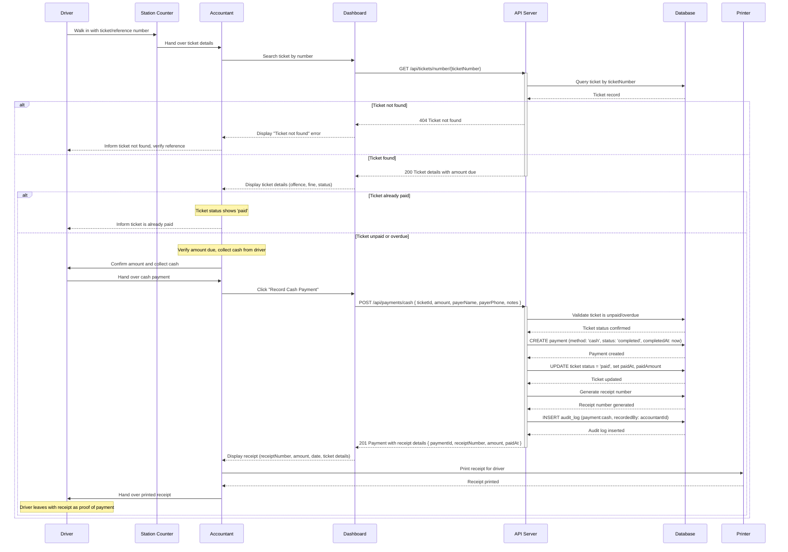

# Cash Payment at Station

This diagram illustrates the walk-in cash payment flow where a driver visits a police station to pay a ticket in person. The accountant searches for the ticket, collects cash, records the payment, and prints a receipt.

