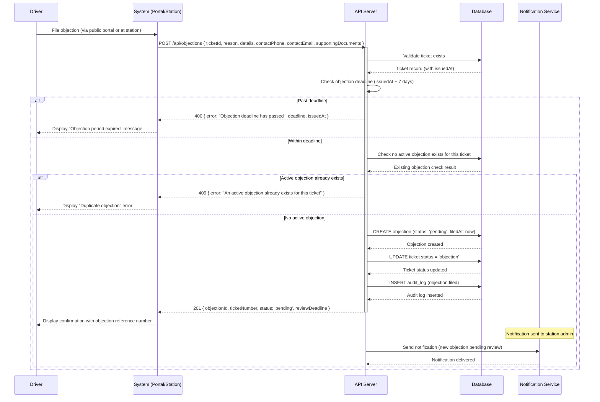
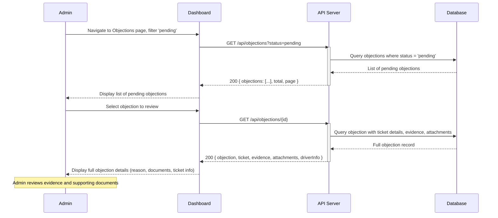
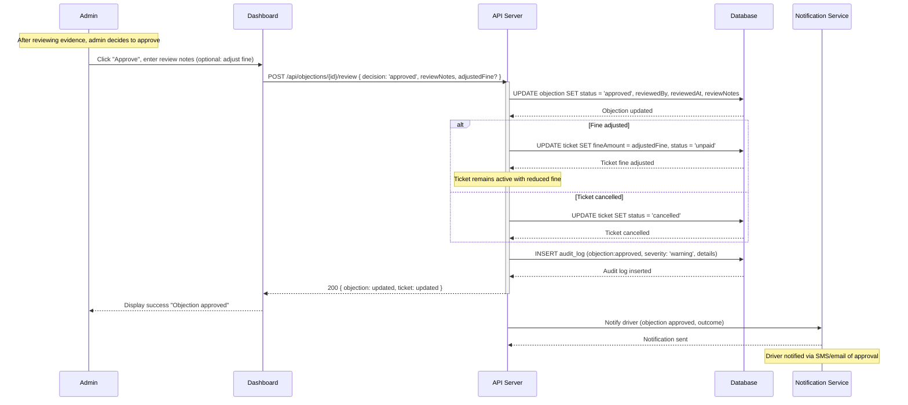
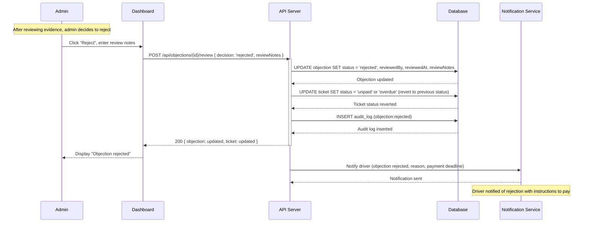

# Objection/Dispute Lifecycle

This diagram illustrates the full objection flow from filing through review to resolution. It covers deadline validation, duplicate objection checks, admin review, and both approval and rejection outcomes.

## Part 1: Filing an Objection

## Part 2: Admin Reviews Objection

## Part 3a: Objection Approved

## Part 3b: Objection Rejected

