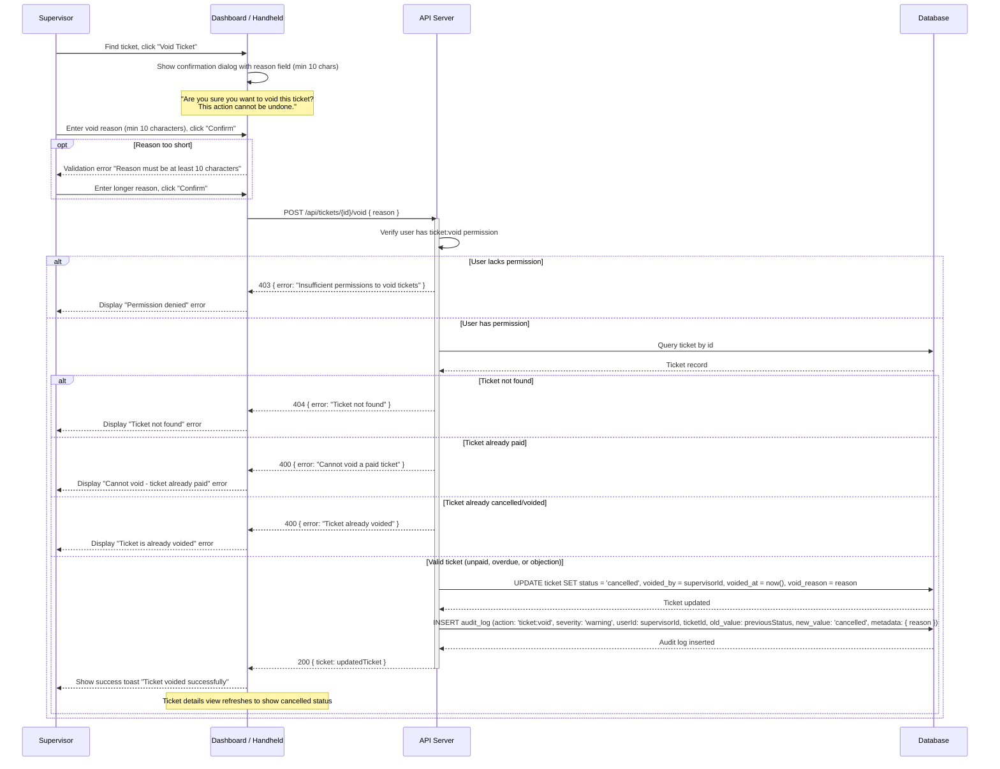

# Ticket Void Flow

This diagram illustrates the process of a supervisor or admin voiding a ticket, including permission checks, status validation, and audit logging.

```mermaid
sequenceDiagram
    participant Supervisor
    participant Dashboard as Dashboard / Handheld
    participant API as API Server
    participant DB as Database

    Supervisor->>Dashboard: Find ticket, click "Void Ticket"

    Dashboard->>Dashboard: Show confirmation dialog with reason field (min 10 chars)
    Note over Dashboard: "Are you sure you want to void this ticket?<br/>This action cannot be undone."

    Supervisor->>Dashboard: Enter void reason (min 10 characters), click "Confirm"

    opt Reason too short
        Dashboard-->>Supervisor: Validation error "Reason must be at least 10 characters"
        Supervisor->>Dashboard: Enter longer reason, click "Confirm"
    end

    Dashboard->>API: POST /api/tickets/{id}/void { reason }
    activate API

    API->>API: Verify user has ticket:void permission

    alt User lacks permission
        API-->>Dashboard: 403 { error: "Insufficient permissions to void tickets" }
        Dashboard-->>Supervisor: Display "Permission denied" error
    else User has permission
        API->>DB: Query ticket by id
        DB-->>API: Ticket record

        alt Ticket not found
            API-->>Dashboard: 404 { error: "Ticket not found" }
            Dashboard-->>Supervisor: Display "Ticket not found" error

        else Ticket already paid
            API-->>Dashboard: 400 { error: "Cannot void a paid ticket" }
            Dashboard-->>Supervisor: Display "Cannot void - ticket already paid" error

        else Ticket already cancelled/voided
            API-->>Dashboard: 400 { error: "Ticket already voided" }
            Dashboard-->>Supervisor: Display "Ticket is already voided" error

        else Valid ticket (unpaid, overdue, or objection)
            API->>DB: UPDATE ticket SET status = 'cancelled', voided_by = supervisorId, voided_at = now(), void_reason = reason
            DB-->>API: Ticket updated

            API->>DB: INSERT audit_log (action: 'ticket:void', severity: 'warning', userId: supervisorId, ticketId, old_value: previousStatus, new_value: 'cancelled', metadata: { reason })
            DB-->>API: Audit log inserted

            API-->>Dashboard: 200 { ticket: updatedTicket }
            deactivate API

            Dashboard-->>Supervisor: Show success toast "Ticket voided successfully"
            Note over Dashboard: Ticket details view refreshes to show cancelled status
        end
    end
```
