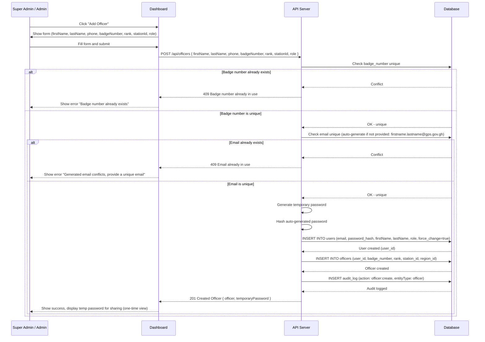
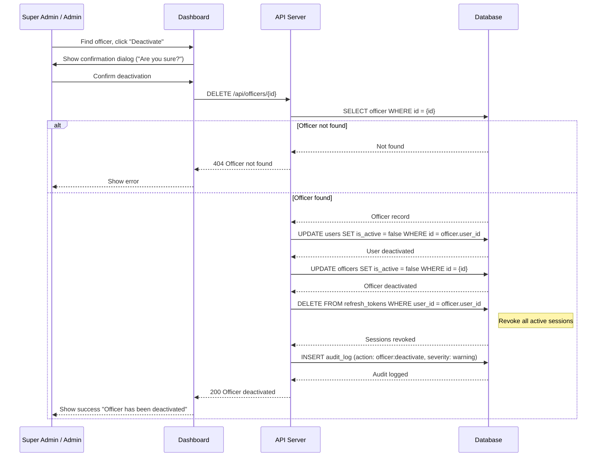
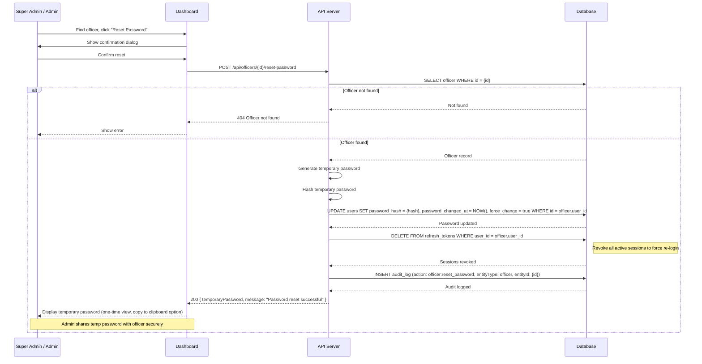

# Officer Management Flows

## 1. Create Officer

```mermaid
sequenceDiagram
    participant Admin as Super Admin / Admin
    participant Dashboard
    participant API as API Server
    participant DB as Database

    Admin->>Dashboard: Click "Add Officer"
    Dashboard->>Admin: Show form (firstName, lastName, phone, badgeNumber, rank, stationId, role)

    Admin->>Dashboard: Fill form and submit
    Dashboard->>API: POST /api/officers { firstName, lastName, phone, badgeNumber, rank, stationId, role }

    API->>DB: Check badge_number unique
    alt Badge number already exists
        DB-->>API: Conflict
        API-->>Dashboard: 409 Badge number already in use
        Dashboard-->>Admin: Show error "Badge number already exists"
    else Badge number is unique
        DB-->>API: OK - unique

        API->>DB: Check email unique (auto-generate if not provided: firstname.lastname@gps.gov.gh)
        alt Email already exists
            DB-->>API: Conflict
            API-->>Dashboard: 409 Email already in use
            Dashboard-->>Admin: Show error "Generated email conflicts, provide a unique email"
        else Email is unique
            DB-->>API: OK - unique

            API->>API: Generate temporary password
            API->>API: Hash auto-generated password

            API->>DB: INSERT INTO users (email, password_hash, firstName, lastName, role, force_change=true)
            DB-->>API: User created (user_id)

            API->>DB: INSERT INTO officers (user_id, badge_number, rank, station_id, region_id)
            DB-->>API: Officer created

            API->>DB: INSERT audit_log (action: officer:create, entityType: officer)
            DB-->>API: Audit logged

            API-->>Dashboard: 201 Created Officer { officer, temporaryPassword }
            Dashboard-->>Admin: Show success, display temp password for sharing (one-time view)
        end
    end
```

## 2. Deactivate Officer

```mermaid
sequenceDiagram
    participant Admin as Super Admin / Admin
    participant Dashboard
    participant API as API Server
    participant DB as Database

    Admin->>Dashboard: Find officer, click "Deactivate"
    Dashboard->>Admin: Show confirmation dialog ("Are you sure?")
    Admin->>Dashboard: Confirm deactivation

    Dashboard->>API: DELETE /api/officers/{id}

    API->>DB: SELECT officer WHERE id = {id}
    alt Officer not found
        DB-->>API: Not found
        API-->>Dashboard: 404 Officer not found
        Dashboard-->>Admin: Show error
    else Officer found
        DB-->>API: Officer record

        API->>DB: UPDATE users SET is_active = false WHERE id = officer.user_id
        DB-->>API: User deactivated

        API->>DB: UPDATE officers SET is_active = false WHERE id = {id}
        DB-->>API: Officer deactivated

        API->>DB: DELETE FROM refresh_tokens WHERE user_id = officer.user_id
        Note right of DB: Revoke all active sessions

        DB-->>API: Sessions revoked

        API->>DB: INSERT audit_log (action: officer:deactivate, severity: warning)
        DB-->>API: Audit logged

        API-->>Dashboard: 200 Officer deactivated
        Dashboard-->>Admin: Show success "Officer has been deactivated"
    end
```

## 3. Reset Password

```mermaid
sequenceDiagram
    participant Admin as Super Admin / Admin
    participant Dashboard
    participant API as API Server
    participant DB as Database

    Admin->>Dashboard: Find officer, click "Reset Password"
    Dashboard->>Admin: Show confirmation dialog
    Admin->>Dashboard: Confirm reset

    Dashboard->>API: POST /api/officers/{id}/reset-password

    API->>DB: SELECT officer WHERE id = {id}
    alt Officer not found
        DB-->>API: Not found
        API-->>Dashboard: 404 Officer not found
        Dashboard-->>Admin: Show error
    else Officer found
        DB-->>API: Officer record

        API->>API: Generate temporary password
        API->>API: Hash temporary password

        API->>DB: UPDATE users SET password_hash = {hash}, password_changed_at = NOW(), force_change = true WHERE id = officer.user_id
        DB-->>API: Password updated

        API->>DB: DELETE FROM refresh_tokens WHERE user_id = officer.user_id
        Note right of DB: Revoke all active sessions to force re-login

        DB-->>API: Sessions revoked

        API->>DB: INSERT audit_log (action: officer:reset_password, entityType: officer, entityId: {id})
        DB-->>API: Audit logged

        API-->>Dashboard: 200 { temporaryPassword, message: "Password reset successful" }
        Dashboard-->>Admin: Display temporary password (one-time view, copy to clipboard option)
        Note over Dashboard,Admin: Admin shares temp password with officer securely
    end
```
