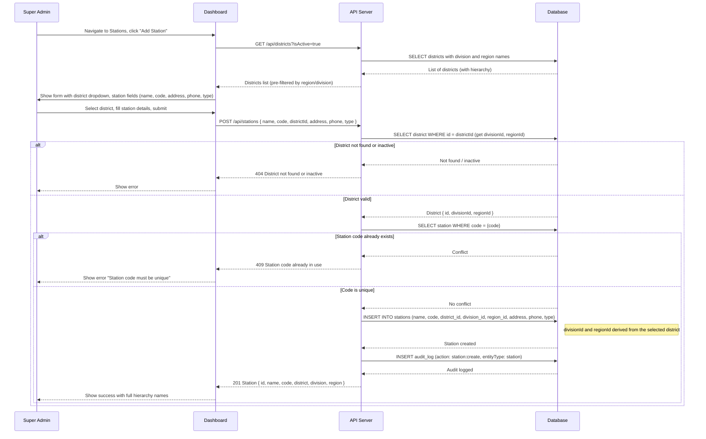
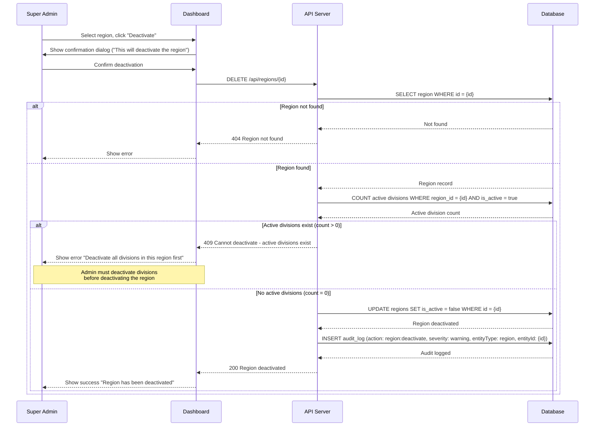
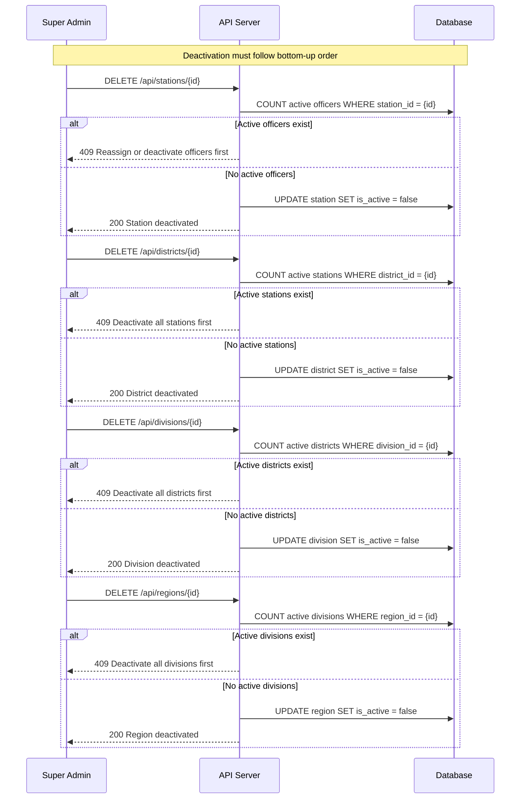

# Organizational Hierarchy Management

> Cascading hierarchy: **Region > Division > District > Station**

## 1. Create Station (with Hierarchy Derivation)

## 2. Deactivate Region (Cascade Protection)

## 3. Hierarchy Cascade Protection Summary

