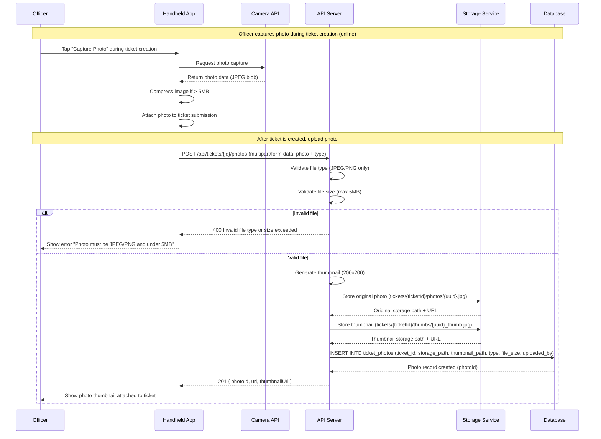
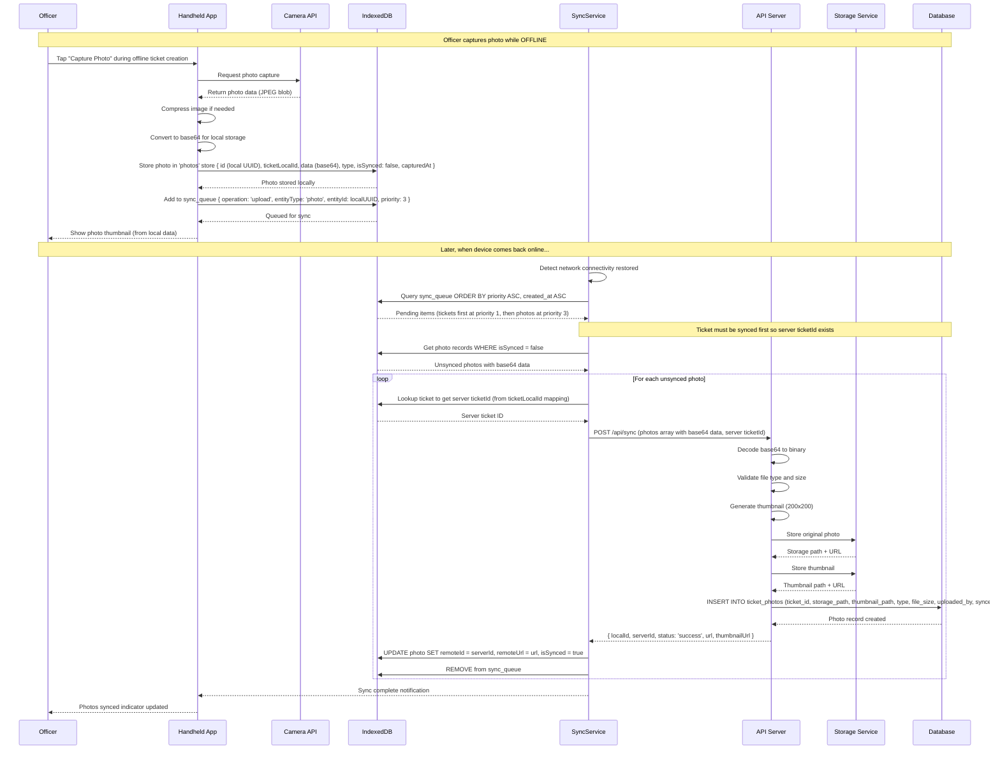
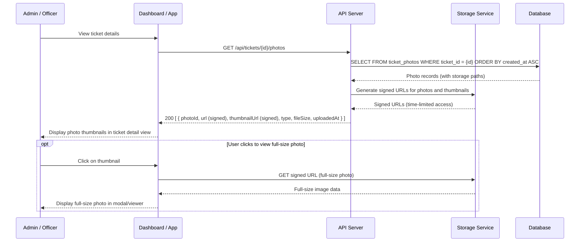

# Photo Upload & Sync Flow

## 1. Direct Photo Upload (Online)

```mermaid
sequenceDiagram
    participant Officer
    participant App as Handheld App
    participant Camera as Camera API
    participant API as API Server
    participant Storage as Storage Service
    participant DB as Database

    Note over Officer,DB: Officer captures photo during ticket creation (online)

    Officer->>App: Tap "Capture Photo" during ticket creation
    App->>Camera: Request photo capture
    Camera-->>App: Return photo data (JPEG blob)

    App->>App: Compress image if > 5MB
    App->>App: Attach photo to ticket submission

    Note over Officer,DB: After ticket is created, upload photo

    App->>API: POST /api/tickets/{id}/photos (multipart/form-data: photo + type)
    API->>API: Validate file type (JPEG/PNG only)
    API->>API: Validate file size (max 5MB)

    alt Invalid file
        API-->>App: 400 Invalid file type or size exceeded
        App-->>Officer: Show error "Photo must be JPEG/PNG and under 5MB"
    else Valid file
        API->>API: Generate thumbnail (200x200)

        API->>Storage: Store original photo (tickets/{ticketId}/photos/{uuid}.jpg)
        Storage-->>API: Original storage path + URL

        API->>Storage: Store thumbnail (tickets/{ticketId}/thumbs/{uuid}_thumb.jpg)
        Storage-->>API: Thumbnail storage path + URL

        API->>DB: INSERT INTO ticket_photos (ticket_id, storage_path, thumbnail_path, type, file_size, uploaded_by)
        DB-->>API: Photo record created (photoId)

        API-->>App: 201 { photoId, url, thumbnailUrl }
        App-->>Officer: Show photo thumbnail attached to ticket
    end
```

## 2. Photo Sync (Offline to Online)

```mermaid
sequenceDiagram
    participant Officer
    participant App as Handheld App
    participant Camera as Camera API
    participant IDB as IndexedDB
    participant Sync as SyncService
    participant API as API Server
    participant Storage as Storage Service
    participant DB as Database

    Note over Officer,DB: Officer captures photo while OFFLINE

    Officer->>App: Tap "Capture Photo" during offline ticket creation
    App->>Camera: Request photo capture
    Camera-->>App: Return photo data (JPEG blob)

    App->>App: Compress image if needed
    App->>App: Convert to base64 for local storage

    App->>IDB: Store photo in 'photos' store { id (local UUID), ticketLocalId, data (base64), type, isSynced: false, capturedAt }
    IDB-->>App: Photo stored locally

    App->>IDB: Add to sync_queue { operation: 'upload', entityType: 'photo', entityId: localUUID, priority: 3 }
    IDB-->>App: Queued for sync

    App-->>Officer: Show photo thumbnail (from local data)

    Note over Officer,DB: Later, when device comes back online...

    Sync->>Sync: Detect network connectivity restored
    Sync->>IDB: Query sync_queue ORDER BY priority ASC, created_at ASC
    IDB-->>Sync: Pending items (tickets first at priority 1, then photos at priority 3)

    Note over Sync,DB: Ticket must be synced first so server ticketId exists

    Sync->>IDB: Get photo records WHERE isSynced = false
    IDB-->>Sync: Unsynced photos with base64 data

    loop For each unsynced photo
        Sync->>IDB: Lookup ticket to get server ticketId (from ticketLocalId mapping)
        IDB-->>Sync: Server ticket ID

        Sync->>API: POST /api/sync (photos array with base64 data, server ticketId)
        API->>API: Decode base64 to binary
        API->>API: Validate file type and size
        API->>API: Generate thumbnail (200x200)

        API->>Storage: Store original photo
        Storage-->>API: Storage path + URL

        API->>Storage: Store thumbnail
        Storage-->>API: Thumbnail path + URL

        API->>DB: INSERT INTO ticket_photos (ticket_id, storage_path, thumbnail_path, type, file_size, uploaded_by, synced_at)
        DB-->>API: Photo record created

        API-->>Sync: { localId, serverId, status: 'success', url, thumbnailUrl }

        Sync->>IDB: UPDATE photo SET remoteId = serverId, remoteUrl = url, isSynced = true
        Sync->>IDB: REMOVE from sync_queue
    end

    Sync-->>App: Sync complete notification
    App-->>Officer: Photos synced indicator updated
```

## 3. Photo Retrieval for Ticket View

```mermaid
sequenceDiagram
    participant User as Admin / Officer
    participant Client as Dashboard / App
    participant API as API Server
    participant Storage as Storage Service
    participant DB as Database

    User->>Client: View ticket details
    Client->>API: GET /api/tickets/{id}/photos

    API->>DB: SELECT FROM ticket_photos WHERE ticket_id = {id} ORDER BY created_at ASC
    DB-->>API: Photo records (with storage paths)

    API->>Storage: Generate signed URLs for photos and thumbnails
    Storage-->>API: Signed URLs (time-limited access)

    API-->>Client: 200 [ { photoId, url (signed), thumbnailUrl (signed), type, fileSize, uploadedAt } ]

    Client-->>User: Display photo thumbnails in ticket detail view

    opt User clicks to view full-size photo
        User->>Client: Click on thumbnail
        Client->>Storage: GET signed URL (full-size photo)
        Storage-->>Client: Full-size image data
        Client-->>User: Display full-size photo in modal/viewer
    end
```
