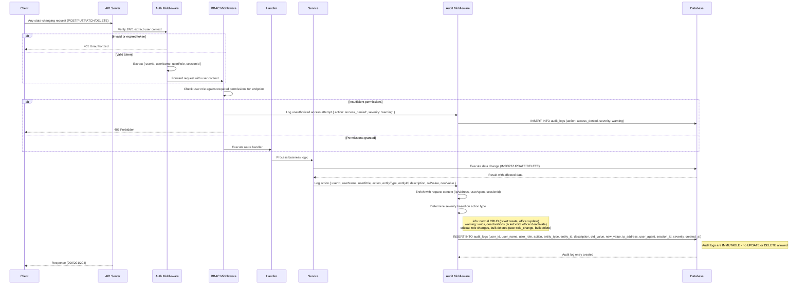
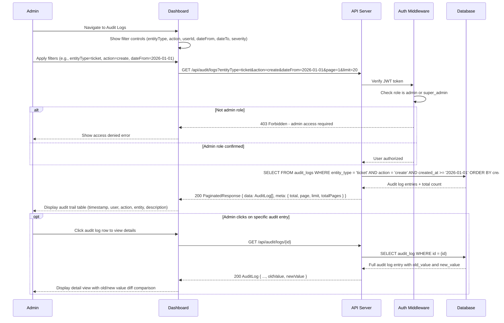
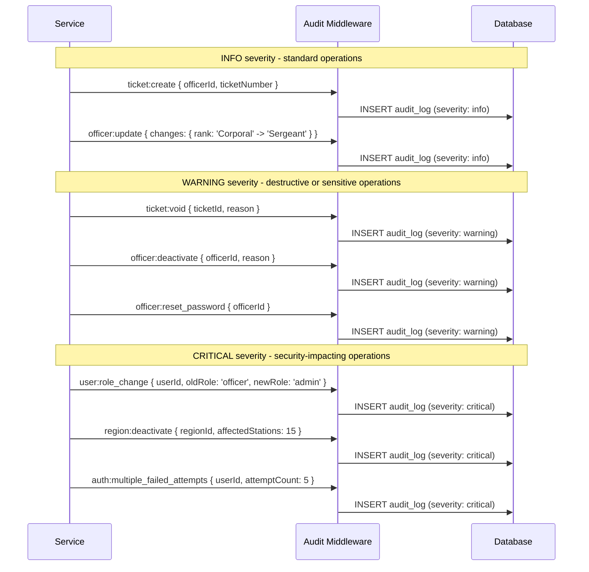

# Audit Logging Flow

## 1. Middleware-Based Audit Logging

```mermaid
sequenceDiagram
    participant Client
    participant API as API Server
    participant Auth as Auth Middleware
    participant RBAC as RBAC Middleware
    participant Handler
    participant Service
    participant Audit as Audit Middleware
    participant DB as Database

    Client->>API: Any state-changing request (POST/PUT/PATCH/DELETE)

    API->>Auth: Verify JWT, extract user context
    alt Invalid or expired token
        Auth-->>Client: 401 Unauthorized
    else Valid token
        Auth->>Auth: Extract { userId, userName, userRole, sessionId }
        Auth->>RBAC: Forward request with user context
    end

    RBAC->>RBAC: Check user role against required permissions for endpoint
    alt Insufficient permissions
        RBAC->>Audit: Log unauthorized access attempt { action: 'access_denied', severity: 'warning' }
        Audit->>DB: INSERT INTO audit_logs (action: access_denied, severity: warning)
        RBAC-->>Client: 403 Forbidden
    else Permissions granted
        RBAC->>Handler: Execute route handler
    end

    Handler->>Service: Process business logic

    Service->>DB: Execute data change (INSERT/UPDATE/DELETE)
    DB-->>Service: Result with affected data

    Service->>Audit: Log action { userId, userName, userRole, action, entityType, entityId, description, oldValue, newValue }

    Audit->>Audit: Enrich with request context (ipAddress, userAgent, sessionId)

    Audit->>Audit: Determine severity based on action type
    Note right of Audit: info: normal CRUD (ticket:create, officer:update)<br/>warning: voids, deactivations (ticket:void, officer:deactivate)<br/>critical: role changes, bulk deletes (user:role_change, bulk:delete)

    Audit->>DB: INSERT INTO audit_logs (user_id, user_name, user_role, action, entity_type, entity_id, description, old_value, new_value, ip_address, user_agent, session_id, severity, created_at)
    Note right of DB: Audit logs are IMMUTABLE - no UPDATE or DELETE allowed

    DB-->>Audit: Audit log entry created

    API-->>Client: Response (200/201/204)
```

## 2. Querying Audit Logs

```mermaid
sequenceDiagram
    participant Admin
    participant Dashboard
    participant API as API Server
    participant Auth as Auth Middleware
    participant DB as Database

    Admin->>Dashboard: Navigate to Audit Logs

    Dashboard->>Dashboard: Show filter controls (entityType, action, userId, dateFrom, dateTo, severity)
    Admin->>Dashboard: Apply filters (e.g., entityType=ticket, action=create, dateFrom=2026-01-01)

    Dashboard->>API: GET /api/audit/logs?entityType=ticket&action=create&dateFrom=2026-01-01&page=1&limit=20

    API->>Auth: Verify JWT token
    Auth->>Auth: Check role is admin or super_admin
    alt Not admin role
        Auth-->>Dashboard: 403 Forbidden - admin access required
        Dashboard-->>Admin: Show access denied error
    else Admin role confirmed
        Auth-->>API: User authorized
    end

    API->>DB: SELECT FROM audit_logs WHERE entity_type = 'ticket' AND action = 'create' AND created_at >= '2026-01-01' ORDER BY created_at DESC LIMIT 20 OFFSET 0
    DB-->>API: Audit log entries + total count

    API-->>Dashboard: 200 PaginatedResponse { data: AuditLog[], meta: { total, page, limit, totalPages } }

    Dashboard-->>Admin: Display audit trail table (timestamp, user, action, entity, description)

    opt Admin clicks on specific audit entry
        Admin->>Dashboard: Click audit log row to view details
        Dashboard->>API: GET /api/audit/logs/{id}
        API->>DB: SELECT audit_log WHERE id = {id}
        DB-->>API: Full audit log entry with old_value and new_value
        API-->>Dashboard: 200 AuditLog { ..., oldValue, newValue }
        Dashboard-->>Admin: Display detail view with old/new value diff comparison
    end
```

## 3. Audit Log Severity Examples

```mermaid
sequenceDiagram
    participant Service
    participant Audit as Audit Middleware
    participant DB as Database

    Note over Service,DB: INFO severity - standard operations

    Service->>Audit: ticket:create { officerId, ticketNumber }
    Audit->>DB: INSERT audit_log (severity: info)

    Service->>Audit: officer:update { changes: { rank: 'Corporal' -> 'Sergeant' } }
    Audit->>DB: INSERT audit_log (severity: info)

    Note over Service,DB: WARNING severity - destructive or sensitive operations

    Service->>Audit: ticket:void { ticketId, reason }
    Audit->>DB: INSERT audit_log (severity: warning)

    Service->>Audit: officer:deactivate { officerId, reason }
    Audit->>DB: INSERT audit_log (severity: warning)

    Service->>Audit: officer:reset_password { officerId }
    Audit->>DB: INSERT audit_log (severity: warning)

    Note over Service,DB: CRITICAL severity - security-impacting operations

    Service->>Audit: user:role_change { userId, oldRole: 'officer', newRole: 'admin' }
    Audit->>DB: INSERT audit_log (severity: critical)

    Service->>Audit: region:deactivate { regionId, affectedStations: 15 }
    Audit->>DB: INSERT audit_log (severity: critical)

    Service->>Audit: auth:multiple_failed_attempts { userId, attemptCount: 5 }
    Audit->>DB: INSERT audit_log (severity: critical)
```
